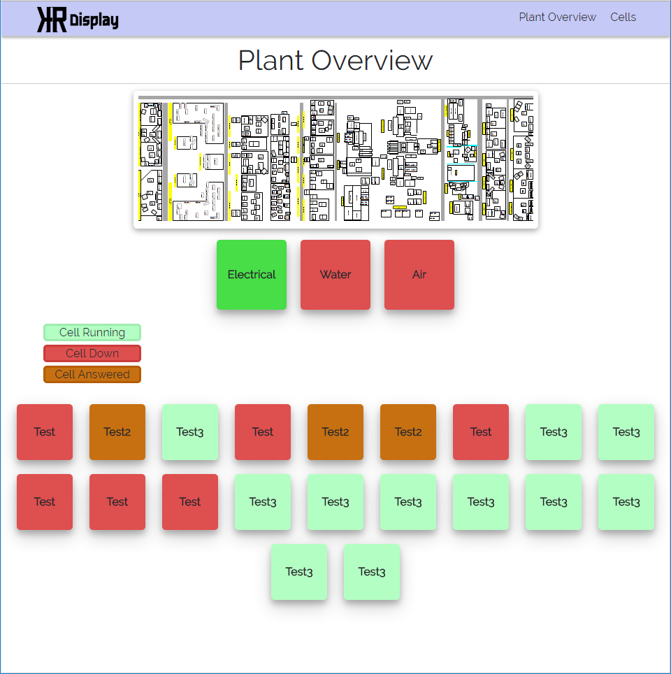
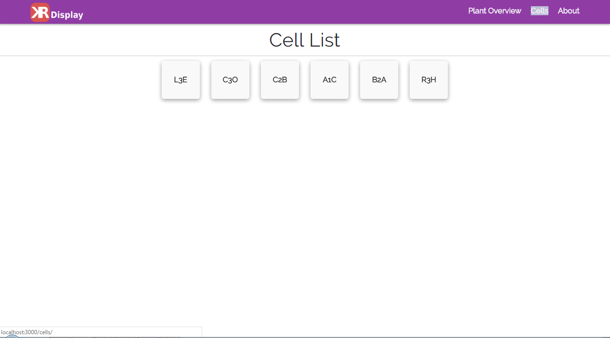
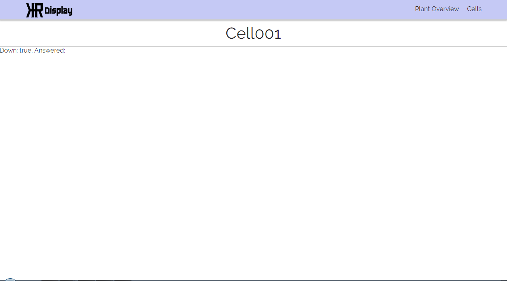

# kr-display
Meteor app for displaying scada data from mssql server.

Created by Kyle Rassweiler

## Screenshots




## Fonts
This project uses the red alert font for the logo and Raleway font for the pages.

## Settings Example
```json
{
	"private":{
		"database":{
			"config":{
				"userName": "User",
				"password": "Password",
				"server":"server",
				"options":{
					"encrypt": false,
					"database": "database"
				}
			}
		},
		"cells":[
			"L3E",
			"C3O",
			"R3H"
		],
		"utilities":[
			"Electrical",
			"Water",
			"Air"
		]
	},
	"public": {
		"plantLayout":{
			"alt":"Test Image",
			"src": "/img/PlantLayout.png"
		}
	}
}
```

## Cell Example
```json
{
  "_id": "ghnDPRwKbAyWbGbbG",
  "name": "Cell001",
  "fault": true,
  "answered": false,
  "downtime":0,
  "totalDown": 0,
  "autoRunning": true,
  "lastCT": 100,
  "targetCT": 110,
  "bestCT": 90,
  "averageCT": 120,
  "partsMade": 90,
  "partsTarget": 120,
  "gap":{
	"valueY":[21,33,-1,-32,-4],
	"valueX":["2016-07-11 00:00:00","2016-07-11 00:01:00","2016-07-11 00:02:00","2016-07-11 00:03:00","2016-07-11 00:04:00"]
  }
}
```

## Utility Example
```json
{
  "_id": "3Wkp4h2yTGPaKv6K9",
  "name": "Electrical",
  "fault": true
}
```

## Setup
- Modify settings.json for your needs
- run meteor --settings settings.json to test on port 3000
- Program will auto populate cells and utilities