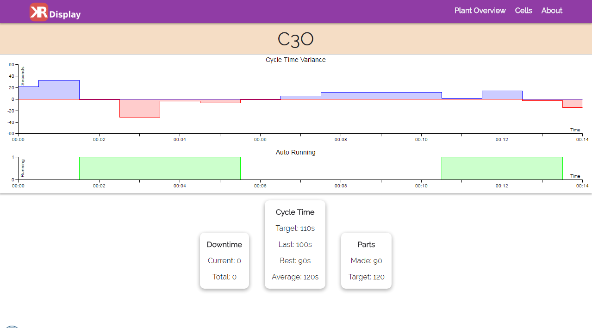

# kr-display
Meteor app for displaying scada data from mssql server.

Created by Kyle Rassweiler

## Setup
- Create settings.json in project root with required settings, see example.
- run the windows bat file to test on port 3000
- Program will auto populate cells and utilities based on values in settings.json.
- The data collection will search the database for column [CellName] or [UtilityName] based on the list of cells or utilities in the settings file.

## Settings Example
```json
{
	"private":{
		"database":{
			"config":{
				"userName": "User",
				"password": "Password",
				"server":"server",
				"options":{
					"encrypt": false,
					"database": "Database"
				}
			}
		},
		"cells":[
			{
				"name":"Test1",
				"group":"A"
			},
			{
				"name":"Test3",
				"group":"A"
			},
			{
				"name":"Test2",
				"group":"B"
			},
			{
				"name":"Test0",
				"group":"B"
			}
		],
		"utilities":[
			"Electrical",
			"Water",
			"Air"
		]
	},
	"public": {
		"plantLayout":{
			"alt":"Plant Layout",
			"src": "/img/PlantLayout.png"
		}
	}
}
```

## Cell Example
```json
{
	"_id": "ghnDPRwKbAyWbGbbG",
	"name": "Cell001",
	"fault": true,
	"answered": false,
	"downtime":0,
	"totalDowntime": 0,
	"lastCT": 100,
	"targetCT": 110,
	"bestCT": 90,
	"averageCT": 120,
	"partsMade": 90,
	"partsTarget": 120,
	"cycleVariance":[21,33,-1,-32,-4,-7,-1,5,12,12,12,1,14,-3,-15],
	"autoRunning": [0,0,1,1,1,1,0,0,0,0,0,1,1,1,0],
	"timeStamp":["2016-07-11 00:00:00","2016-07-11 00:01:00","2016-07-11 00:02:00","2016-07-11 00:03:00","2016-07-11 00:04:00","2016-07-11 00:05:00","2016-07-11 00:06:00","2016-07-11 00:07:00","2016-07-11 00:08:00","2016-07-11 00:09:00","2016-07-11 00:10:00","2016-07-11 00:11:00","2016-07-11 00:12:00","2016-07-11 00:13:00","2016-07-11 00:14:00"]
}
```

## Utility Example
```json
{
	"_id": "3Wkp4h2yTGPaKv6K9",
	"name": "Electrical",
	"fault": true
}
```

## Screenshots
### Home

### Cell List

### Running Cell

### Faulted Cell

### Answered Cell
