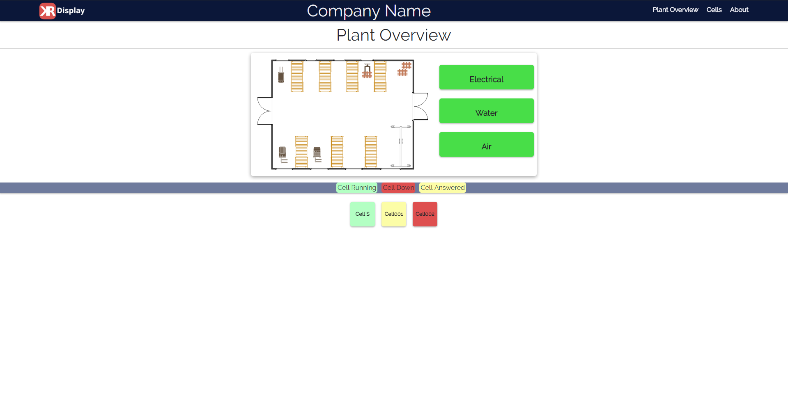
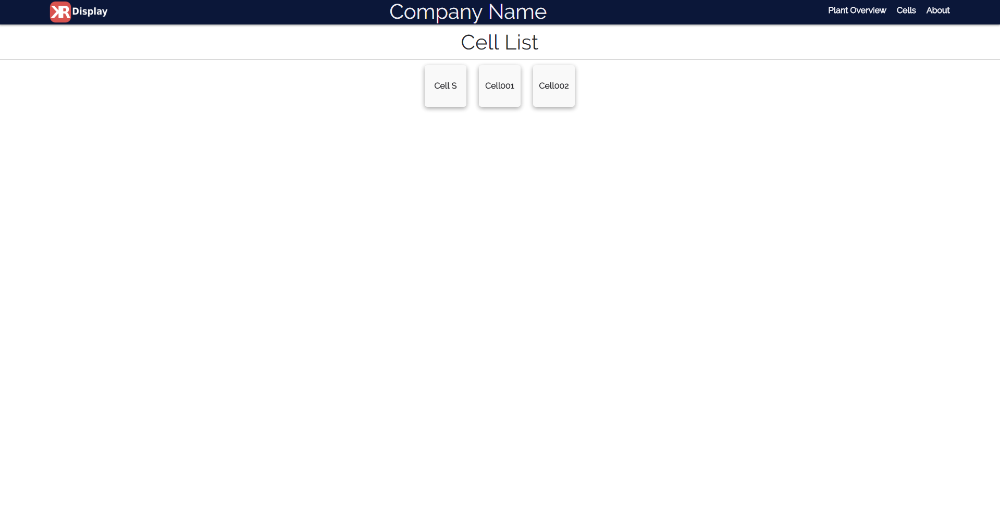
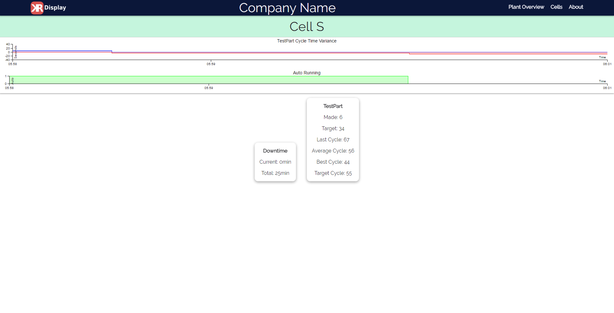
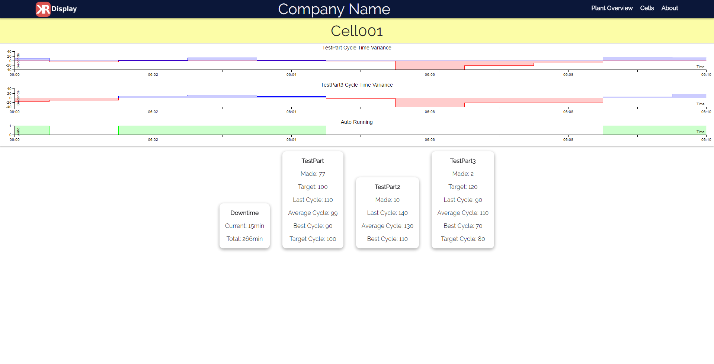
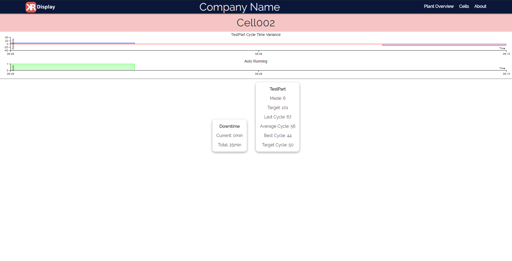

# kr-display
Meteor app for displaying scada data from mssql server.

Created by Kyle Rassweiler

## License
[License](LICENSE)

## Screenshots
### Home

### Cell List

### Running Cell

### Answered Cell

### Faulted Cell

## Installation
- [Windows](Documentation/Windows.md)
- [Linux](Documentation/Linux.md)
- [Apple](Documentation/Apple.md)

## Settings Documention
KR-Display uses a single setting file located in the root for project specific data.
- [Settings File Documentation](Documentation/Settings.md)

## Database 
- [Cell Documentation](Documentation/Cells.md)
- [Utility Documentation](Documentation/Utilities.md)

## TODO
- [x] Windows setup documentation.
- [ ] Windows deployment documentation.
- [ ] Linux setup documentation.
- [ ] Linux deployment documentation.
- [ ] Comment code.
- [ ] Proper checks and faults if settings file not set.
- [x] Handle spaces in cell names.